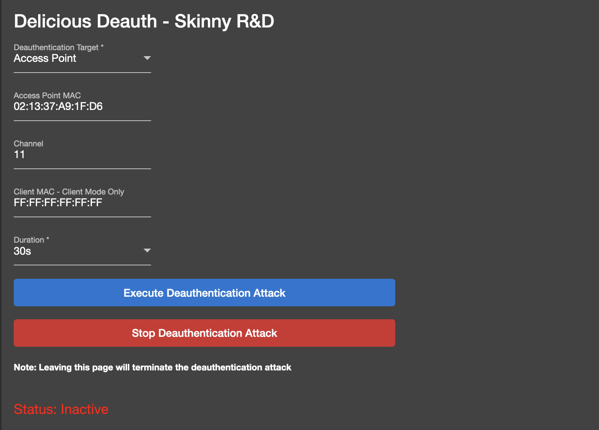

# Forbidden-Pineapple
Skinny R&amp;D Modules For The Hak5 Wi-Fi Pineapple

# Install
To install a module, download the [modulename].tar.gz file where 'modulename' is the name of the module you would like to install (ex: DeliciousDeauth.tar.gz).  Browse to the main page of the Wi-Fi Pineapple Mark VII and select the 'modules' tab from the left navigation menu:

From the modules menu, select the 'more options' icon in the top right corner of the screen:

Click the 'Sideload Module' button:

Click the 'Upload .tar.gz' button and select the '[modulename].tar.gz' file that you downloaded from this repository:

If successful, you should see a new module appear on the modules page:

---
# Current Modules

### DeliciousDeauth - Continuous Wi-Fi Deauthentication Module

To use this module, first select a deauthentication target from the top dropdown list.  The options for this dropdown are 'Access Point' mode and 'Client' mode.  Access Point mode will deauthenticate every device associated with the access point.  Client mode will target a client and will only deauthenticate the specified client. 

To load client and access point data from previous recon scans, select the dropdown list under 'SSID List':

Once a scan is loaded, the SSID list will be populated with data:

The following options are required in 'Access Point' Mode:

* Access Point Mac Address - BSSID or 'MAC' address of the target access point
* Channel - The Wi-Fi channel of the target access point
* Duration - The amount of time the deauthentication attack should run (30s, 1m, 5m, Coninuous)

The following options are required in 'Client' Mode:

* Access Point Mac Address - BSSID or 'MAC' address of the target access point
* Client Mac Address - The MAC address of the target client
* Channel - The Wi-Fi channel of the target access point
* Duration - The amount of time the deauthentication attack should run (30s, 1m, 5m, Coninuous)

To start and stop an attack, use the blue and red buttons located in the middle of the page:

Once the module has been executed, you will see the status label change to inform you that the module is running.

